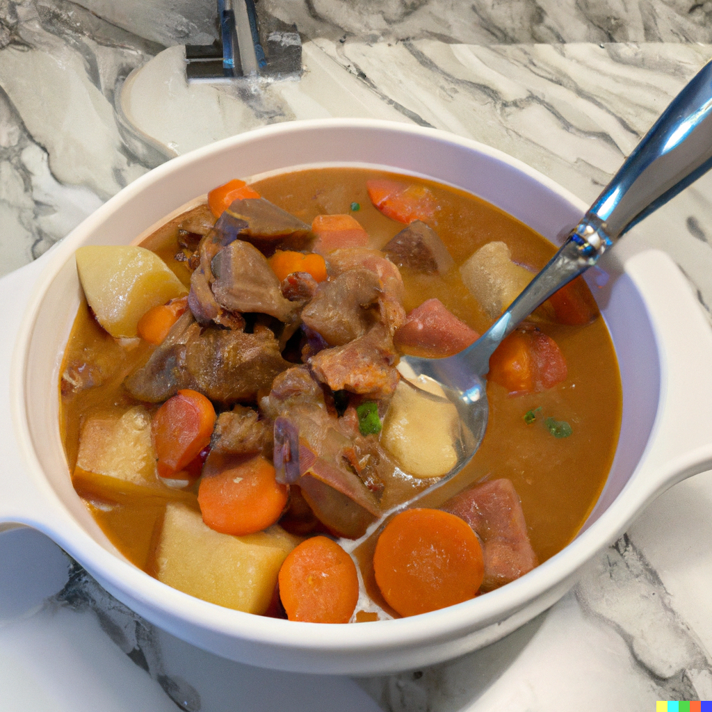
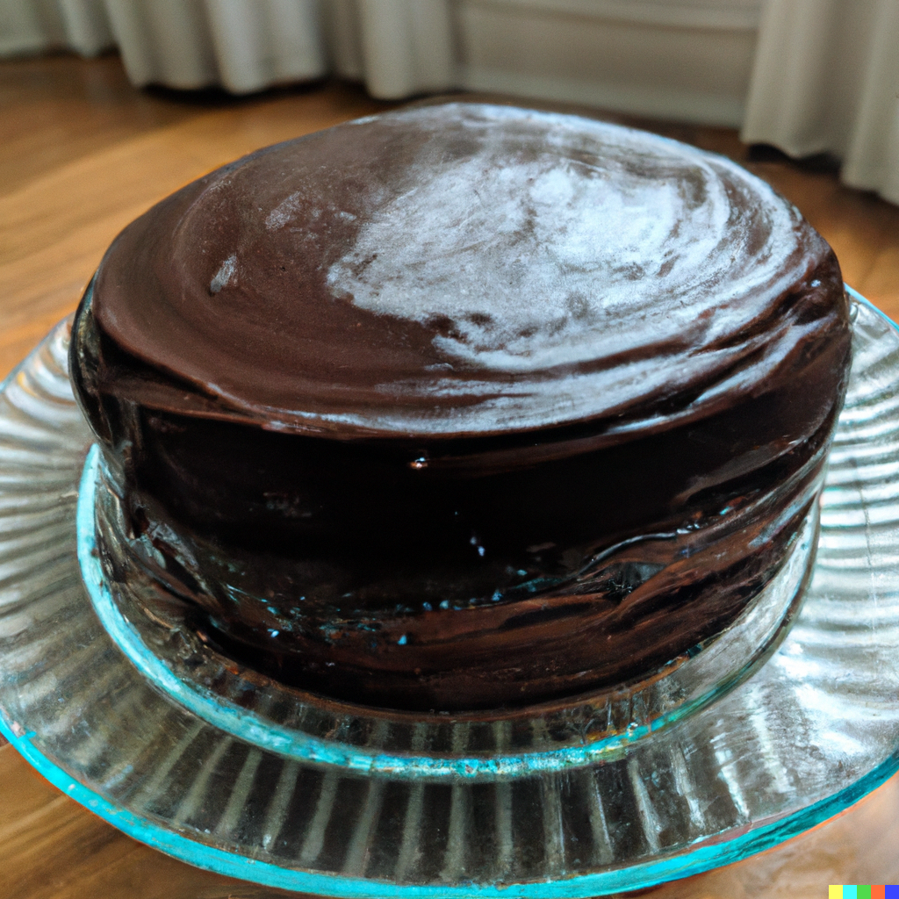

# Hobbies 

## A Chef in the kitchen

As a passionate and skilled home cook, I have a variety of favourite recipes that I enjoy preparing for my family and friends. Some of my all-time favourite dishes include:

- A hearty and savory beef stew, made with tender chunks of beef, carrots, potatoes, and a rich tomato-based broth. I love to serve this comforting dish on a cold winter's night, with a side of crusty bread to soak up all the delicious juices.

- A vibrant and refreshing summer salad, made with a variety of fresh, seasonal ingredients such as cherry tomatoes, cucumbers, and mixed greens. I like to add a touch of sweetness to the salad with some sliced strawberries or a drizzle of honey, and finish it off with a light and creamy vinaigrette dressing.

- A classic and indulgent chocolate cake, made with rich, dark chocolate and topped with a decadent chocolate ganache frosting. My secret to making the perfect chocolate cake is to use high-quality ingredients and to pay attention to the details, such as mixing the batter just until it comes together and not overbaking the cake.

Overall, my favourite recipes are those that are flavourful, satisfying, and make people happy when they eat them. I enjoy experimenting with different ingredients and techniques, and am always looking for new inspiration and ideas to add to my recipe collection.

## Reading

Reading is another activity that brings me a lot of joy. I am particularly interested in science fiction and fantasy literature, and love the opportunity to immerse myself in fantastical worlds and explore the limits of my imagination. I am a member of several online book clubs and enjoy discussing books with others and sharing my thoughts and opinions on different works.

Favourite books:
1. "Dune" by Frank Herbert - This classic science fiction novel follows the story of Paul Atreides, a young nobleman who becomes embroiled in a power struggle for control of the desert planet Arrakis, the only source of the spice melange.

1. "The Hitchhiker's Guide to the Galaxy" by Douglas Adams - This humorous science fiction novel follows the misadventures of an unwitting human and his alien friend as they travel through the galaxy, encountering all manner of strange and absurd creatures along the way.

1. "The Lord of the Rings" by J.R.R. Tolkien - This epic fantasy tale follows the journey of a hobbit named Frodo who must undertake a quest to destroy a powerful and evil ring, aided by a diverse group of companions.

1. "The Martian" by Andy Weir - This science fiction novel follows the story of Mark Watney, an astronaut who is stranded on Mars and must use his wit and resourcefulness to survive and find a way back to Earth.

1. "Ready Player One" by Ernest Cline - This science fiction novel is set in a future where humanity spends much of its time in a virtual reality world called the OASIS, and follows the story of a young man who embarks on a quest to find a hidden Easter egg left by the OASIS's creator.

1. "The Dark Tower" by Stephen King - This epic fantasy series follows the story of Roland Deschain, a gunslinger on a quest to find the mysterious Dark Tower, a nexus of all possible worlds.

1. "The Name of the Wind" by Patrick Rothfuss - This fantasy novel tells the story of Kvothe, an orphan who grows up to become a legendarily talented wizard, and chronicles his rise to power and the many adventures he encounters along the way.

1. "The Diamond Age" by Neal Stephenson - This science fiction novel follows the story of a young girl who is gifted with a unique and advanced interactive book, and the many adventures she has as she grows up and explores the world.

1. "Snow Crash" by Neal Stephenson - This science fiction novel is set in a future where the real world and virtual reality are intertwined, and follows the story of a hacker and a courier who team up to take on a powerful and mysterious corporation.

1. "American Gods" by Neil Gaiman - This fantasy novel follows the story of an ex-con who becomes embroiled in a battle between the old gods of myth and legend and the new gods of technology and media.