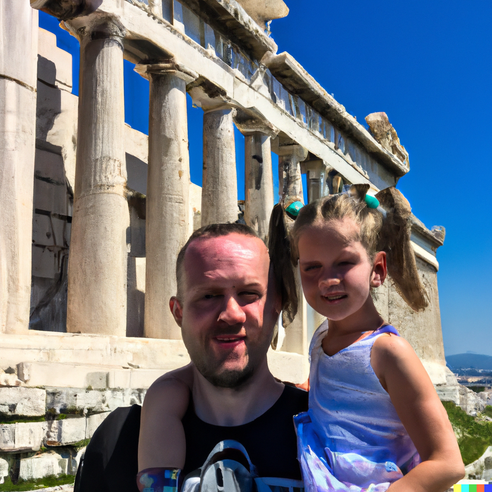
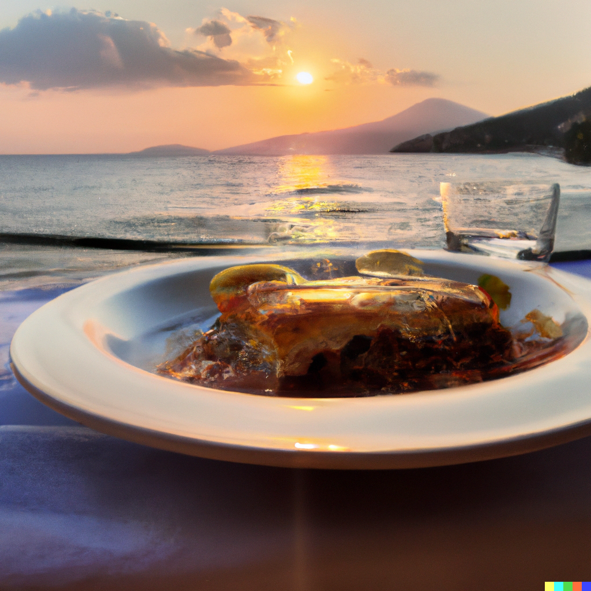

# Travel

## Greece

I had been dreaming of visiting Greece for as long as I could remember, and when my husband and I decided to take our daughter on holiday there, I was over the moon with excitement. We packed our bags and set off bright and early, eager to explore all that the beautiful country had to offer.

As we flew over the sparkling waters of the Aegean Sea, I couldn't help but feel a sense of excitement and anticipation building inside me. I had always dreamed of visiting Greece, with its ancient ruins, stunning beaches, and delicious food, and I couldn't wait to experience it all with my family.

After a long flight, we arrived in Athens and checked into our hotel. We spent our first few days exploring the city, taking in the sights and sounds of the bustling metropolis. We visited the iconic Acropolis, marveling at the ancient ruins of the Parthenon and taking in the breathtaking views of the city below.

From Athens, we set off on a road trip through the beautiful countryside, stopping at charming villages and breathtaking beaches along the way. We hiked through the picturesque hills of the Peloponnese, marveling at the stunning views and the rich history of the region.

As we traveled, we sampled the delicious food and drink of Greece, from the savory gyros and moussaka to the refreshing ouzo and retsina. We also spent time relaxing on the sandy beaches, soaking up the sun and enjoying the crystal clear waters of the Mediterranean.

Despite the many adventures and exciting experiences we had on our holiday, my family and I were sad to leave Greece behind when it was time to return home. But we knew that we had created memories that would last a lifetime, and we were already planning our next trip to this beautiful and captivating country.

